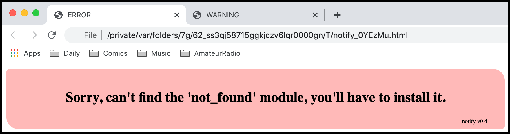
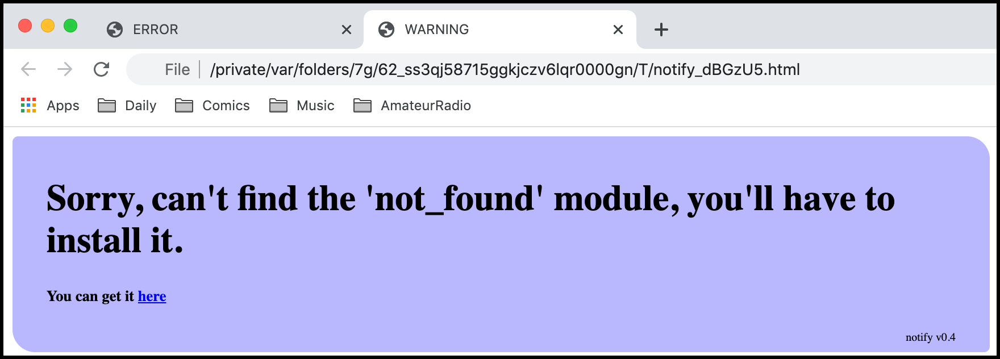

notify
======

A (hopefully) cross-platform method of notifying some sort of problem for
python.

If you write a python GUI program that starts from a desktop icon or
a filemanager item you have a problem if the program cannot properly
initialise the GUI environment.  You can't **print** anything as there
is no terminal to show the error text.

My first attempt to solve this problem used the Tkinter module.  This is
part of python, so should always be there, right?  Ha!  Under Ubuntu the
Tkinter module is not installed automatically, you have to do:

::

    sudo apt-get install python-tk

I believe that is also true under Mac OSX.

This current solution has a better chance of working on more platforms.
It definitely works under OSX.  It works under Ubuntu.  Maybe it
works under other Linuxes and Windows.  I'll test all those eventually.

To use it:

::

    import notify
    
    notify.notify('''Sorry, can't find Python, you'll have to install it.''',         
                  '''You can get it <a href="http://www.wxpython.org/download.php">here</a>''')

The notify() function has the signature:

::

    notify(msg, submsg=None, html=None, header=None, colour=None)

The **msg** and **submsg** parameters are the error message(s).  The **html**
parameter allows the user to change the page HTML displayed in the browser.
The default HTML is:

::

    

        <h2>{msg}</h2>                                                       
        <h4>{submsg}</h4>                                                    
    

You may substitute any HTML you prefer remembering that the supplied HTML may
use the **msg** and **submsg** slots for formatting and no others.  Also
remember that the supplied HTML is embedded inside a ``
`` in the HTML
body.

The **header** parameter allows the user to change the tab header text.
The default header is "ERROR".

The **colour** parameter lets the user set the colour of the message box.
The default colour is "#ffb8b8".

Testing
-------

If you execute:

::

    python notify.py

you will see these two pages appear in the default browser:

An ERROR page:

And a WARNING page:

